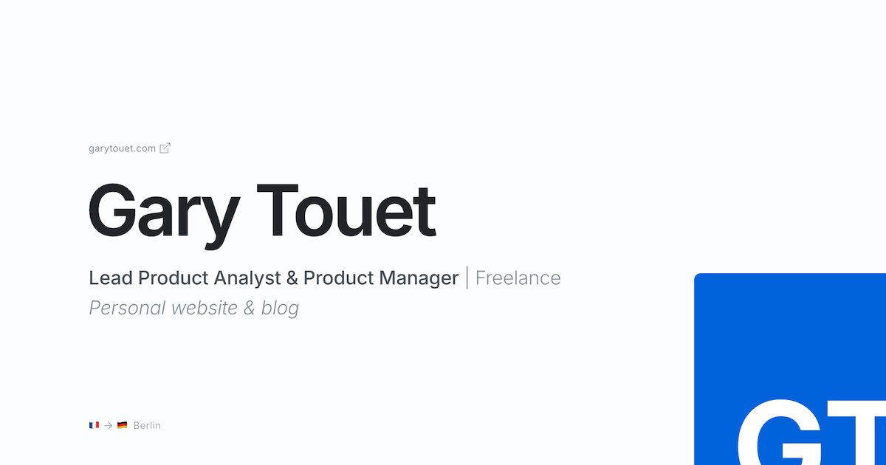

Open Graph images are used by social media platforms like LinkedIn and Facebook to preview websites when URLs are shared. My site lacked one, so I decided to create it.

I already [created the favicon](../../2025/create-favicon-with-ggplot2/index.qmd) with _ggplot2_. In the same vein, I thought it could be fun to create the Open Graph image programmatically.

This turned into a much bigger project than I expected. I'll share the twists and turns at the end of this post. First, let's see how the Open Graph image can be created in Python.

This is the reference image:



## Step-by-step creation of the image

### Imports

```{python}
# | label: imports
from PIL import Image, ImageDraw, ImageFont
from cairosvg import svg2png
```

For most of this project, we’ll use the [_pillow_ library](https://pypi.org/project/pillow/). To work with `.svg` graphical elements (not natively supported by pillow), we’ll also use [_cairosvg_](https://pypi.org/project/CairoSVG/).

### Design variables

Below, I define style variables (colours, fonts, text sizes, layout options, etc.) for easy reference later in the code.

```{python}
# | label: design-variables
background_color = "#FCFDFF"
title_color = "#212529"
primary_text_color = "#495057"
secondary_text_color = "#869099"

base_text_size = 16 # <1>
small_text_size = base_text_size * 0.8
body_text_size = base_text_size * 1.6
title_text_size = base_text_size * 6

font_path = "/font/InterVariable.ttf"
italics_font_path = "/font/InterVariable-Italic.ttf"

left_margin = 120
radius = 18

dpi = 320
```

1. This approach is inspired by CSS’s `rem` unit. All measurements in the code are multiples of this base unit, which simplifies scaling and adjustments.

### Blank canvas

The code generates a simple rectangle matching the website’s background color, using the [recommended dimensions for OG images](https://www.ogimage.gallery/libary/the-ultimate-guide-to-og-image-dimensions-2024-update#:~:text=Standard%20Size:%201200x630%20pixels).

```{python}
# | label: blank-canvas

# OG image standard size
width_px = 1200
height_px = 630

# Create base image
og = Image.new("RGBA", (width_px, height_px), color=background_color)
draw = ImageDraw.Draw(og)
og
```

### Text elements

Let's start with the simplest text elements. The more complicated cases (combinations of text and graphics) will be addressed later.

```{python}
# | label: text
title = "Gary Touet"
sub1 = "Lead Product Analyst & Product Manager"
sub2 = " | Freelance"
descr = "Personal website & blog"
```

First, the title.

```{python}
# | label: draw-title
title_font = ImageFont.truetype(font_path, size=title_text_size)  # <1>
title_font.set_variation_by_axes([32.0, 600.0])  # <2>
draw = ImageDraw.Draw(og)  # <3>
draw.text(
    (left_margin, 225), title, font=title_font, fill=title_color, language="en"
)  # <4>
og
```

1. Define the title font using a font file path and size.
2. The font file includes two adjustable parameters: `Optical size` and `Weight`. Optical size adjusts letter shapes and spacing for different text sizes, while weight controls text thickness (from thin to bold).
3. Create this once before drawing on the image.
4. The drawing command places the text at specified coordinates, assigns a font and color, and sets the language to English. Some fonts include language-specific settings.

Apply the same process to the remaining text elements:

```{python}
# | label: draw-subtitle-description

## sub1
sub1_font = ImageFont.truetype(font_path, size=body_text_size)
sub1_font.set_variation_by_axes([14.0, 500.0])
draw.text(
    (left_margin, 360), sub1, font=sub1_font, fill=primary_text_color, language="en"
)
sub1_length = draw.textlength(sub1, font=sub1_font)  # <1>

## sub2
sub2_font = ImageFont.truetype(font_path, size=body_text_size)
sub2_font.set_variation_by_axes([14.0, 300.0])
draw.text(
    (left_margin + sub1_length, 360),  # <2>
    sub2,
    font=sub2_font,
    fill=secondary_text_color,
    language="en",
)

## descr
descr_font = ImageFont.truetype(italics_font_path, size=body_text_size)
descr_font.set_variation_by_axes([14.0, 300.0])
draw.text(
    (left_margin, 400), descr, font=descr_font, fill=secondary_text_color, language="en"
)

og
```

1. This line stores the length of the text `Lead Product Analyst & Product Manager` for positioning the subsequent text segment, ` | Freelance`.
2. This is where the position of the subsequent segment is calculated.

### Text and Graphic Combinations

This section covers two complex cases:

1. Domain name with icon
1. Emoji and text combinations

First, render the domain name as plain text.
```{python}
#| label: domain-name
url = "garytouet.com"

## font
url_font = ImageFont.truetype(font_path, size=small_text_size)
url_font.set_variation_by_axes([14.0, 300.0])
draw.text(
    (left_margin, 190),
    url,
    font=url_font,
    fill=secondary_text_color,
    language="en",
)

og
```

To place the `.svg` icon after the domain name, we need to measure the length of the text preceding it.

Also, we need _cairosvg_ to handle the `.svg` file. The `svg2png` function resizes the `.svg` icon and converts it to `.png`. We can then place it on the canvas.

```{python}
# | label: place-icon-for-domain-name

svg = svg2png(
    url="icons/box-arrow-up-right.svg",
    output_width=small_text_size,
    output_height=small_text_size,
    dpi=dpi,
    write_to="/tmp/link_icon.png",
)

png = Image.open("/tmp/link_icon.png")

length_url = int(
    draw.textlength(url, font=url_font) + base_text_size / 4
)  # length of the text + a bit of space

og.paste(png, (left_margin + length_url, 191), mask=png)

og
```

Next, let's handle the combination of emoji and text at the bottom of the image. Emojis are part of a macOS font and should be rendered as such.

```{python}
# | label: emojis-text
emoji_font = ImageFont.truetype(
    "/System/Library/Fonts/Apple Color Emoji.ttc", size=20
)  # <1>
text_font = ImageFont.truetype(font_path, size=small_text_size)
text_font.set_variation_by_axes([14.0, 300.0])

segments = [
    ("🇫🇷", emoji_font),
    ("->", text_font),
    ("🇩🇪", emoji_font),
    (" Berlin", text_font),
]  # the text is broken down into several segments so that the corresponding emoji font can be used for the flags

# Starting position
x, y = (left_margin, 570)

for text, font in segments:
    draw.text(
        (x, y - (base_text_size * 0.06) if font == emoji_font else y),
        text,
        font=font,
        embedded_color=True if font == emoji_font else None,
        fill=secondary_text_color,
    )
    x += draw.textlength(text, font=font) + (base_text_size * 0.12)

og
```

1. Limitation: The minimum emoji font size is 20, which is slightly larger than ideal but acceptable to me.

### Blue GT icon

This involves manipulating another `.svg` icon.

```{python}
# | label: GT-icon

svg = svg2png(
    url="icons/gt-icon.svg",
    output_width=680,
    output_height=680,
    dpi=dpi,
    write_to="/tmp/resized_icon.png",
)
png = Image.open("/tmp/resized_icon.png").convert("RGBA")

# Create a mask with rounded corners
mask = Image.new("L", png.size, 0)
draw = ImageDraw.Draw(mask)
draw.rounded_rectangle([(0, 0), mask.size], radius=radius, fill=255)
png.putalpha(mask)

# Resize the icon to half its original size to fight aliasing
png = png.resize(tuple(int(s / 2) for s in png.size), resample=Image.LANCZOS)

# Paste the icon on the canvas in its new size with the rounded corners mask
og.paste(im=png, box=(940, 370), mask=png)

og
```

This code block performs several operations:

1. **Add rounded corners to the icon:** to do this, create a rounded-corner mask and apply it to the image (similar to Photoshop). In the end, [this article](https://note.nkmk.me/en/python-pillow-composite/), especially the section _Create mask image by drawing_, pointed me in the right direction. Then, this [second article](https://note.nkmk.me/en/python-pillow-putalpha/) about `putalpha()` made me understand how to apply a transparent mask to an image. Finally, with my LLM of choice, I managed to craft the solution above.
1. **Smoothen corners:** The rounded corners initially appeared pixelated (aliasing). Since Pillow lacks a direct anti-aliasing method, a [StackOverflow suggestion](https://stackoverflow.com/questions/14350645/is-there-an-antialiasing-method-for-python-pil) recommended rendering the image at a higher resolution and resizing it with `resample=Image.LANCZOS`. I opted for scaling the original icon to twice the desired size before resizing and resampling.

### End result

Let's compare the final output to the reference image. The programmatically generated image (using _pillow_) includes a dot in the top right corner.

```{python}
#| label: save-image-to-disk

# Add a dot in the top right corner for the image created with pillow
draw = ImageDraw.Draw(og)
draw.circle((width_px - 20, 20), radius = 10, fill=title_color)

# Save the end result to disk
og.save(fp="open-graph-image-pillow.png", format="png")
```

```{python}
# | label: create-comparison-gif

# create a gif with both images for comparison
import imageio.v3 as imageio

filenames = ["open-graph-image.png", "open-graph-image-pillow.png"]
images = []
for filename in filenames:
    images.append(imageio.imread(filename))
imageio.imwrite("comparison.gif", images, format="GIF", fps=1, loop=0)
```


### Conclusion

The final output shows subtle but noticeable differences compared to the reference image:

- Font sizes could be adjusted further, though the emojis are already at their minimum size. This is not a critical issue for me.
- The rounded corners appear slightly blurry and less crisp. However, this is not a significant concern.
- The text rendering differs: at small sizes, it appears cramped, and at larger sizes, the kerning seems inconsistent. The reference image’s text is more harmonious and optically balanced, with refined letter spacing. This is a critical issue for me, so I will use the reference version.

I tried my best to tweak the font rendering done by _pillow_, but without success. After a bit of research, I concluded that the font rendering implemented in the library is limited and doesn't take advantage of all the features included in the Inter font, as opposed to the software I used to create my reference image.

## Twists and turns

Let’s reflect on the project's journey.

When I started this project, I only had a vague idea of what I wanted to create. This lack of clarity complicated the process, as testing design ideas through code is far more time-consuming than using a dedicated design tool (obviously!). Ultimately, I decided to finalize the design visually before coding. I set out to replicate the design in python, which was still a worthy endeavour.

My initial idea was to use _plotnine_ (the equivalent of _ggplot2_ in Python). However, I encountered two major obstacles:

1. _plotnine_ doesn't have `geom_image()`, which meant that I had to go one level deeper and use _matplotlib_ to manipulate and add images to my plot. I managed to do it, but suddenly it felt like _plotnine_ was not the tool for the job. Well, it was not from the start given my goal here, but even more so... :) 
1. My design requires different font weights for different text elements. And I want them to be consistent with the weights used on the rest of this website. I found this step difficult with `geom_text()` and `annotate()`, which are not that advanced. Again, I had to resort to _matplotlib_ and its `font_manager`. And still, it was difficult. I believe I used the right methods and functions. However, I couldn't see the text change on my plot. After a lot of trial and error, I concluded that I was asking too much of these tools and that I needed something more adapted to the job. This led me to _pillow_, which enabled me to complete the project successfully.


